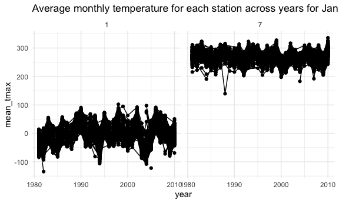

P1805_HW3_kp2809
================
Kimberly Lopez
2024-10-07

Loading Data

``` r
data("ny_noaa")
nrow(ny_noaa)
```

    ## [1] 2595176

The ny_noaa data set has 7 columns and 2.5 million row entries which
detail the id, date of observed data, and precipitation (tenths of mm),
snow (mm), snow depth (mm), temperature max(tenths of degrees C), and
temperature min (tenths of degrees C). Id being Weather station ID
name.There is some missing data in columns for precipitation, snwd,
tempertaure max and min.

Do some data cleaning. Create separate variables for year, month, and
day. Ensure observations for temperature, precipitation, and snowfall
are given in reasonable units. For snowfall, what are the most commonly
observed values? Why?

- date has year, month, and day. Need to pivot wider and save into 3 new
  columns

``` r
ny_noaa = 
  ny_noaa |>
  separate(date, into = c("year", "month", "day"), convert = TRUE) |> 
  mutate(
    tmax = as.numeric(tmax),
    tmin = as.numeric(tmin))
```

``` r
ny_noaa |> 
  select(snow)|>
  drop_na()|>
  pull(snow)|> 
  range()
```

    ## [1]   -13 10160

The range of snow fall is -13 to 10,160.

*Temperature*

The range of temperature is -1-99 which could be in F rather than
Celcius.

The range for precipitation is 22860 which leads me to think they are
not in the same units. There appears to be 4 outliers in reported
snowfall which might be calculated in different units. Make a two-panel
plot showing the average max temperature in January and in July in each
station across years. Is there any observable / interpretable structure?
Any outliers?

``` r
ny_noaa |> 
  group_by(id, year, month) |> 
  filter(month %in% c(1, 7)) |> 
  summarize(mean_tmax = mean(tmax, na.rm = TRUE, color = id)) |> 
  ggplot(aes(x = year, y = mean_tmax, group = id)) + 
  geom_point() + 
  geom_path() +
  facet_grid(~month) +
  labs(title = "Average monthly temperature for each station across years for January and July")
```

    ## `summarise()` has grouped output by 'id', 'year'. You can override using the
    ## `.groups` argument.

    ## Warning: Removed 5970 rows containing missing values or values outside the scale range
    ## (`geom_point()`).

    ## Warning: Removed 5931 rows containing missing values or values outside the scale range
    ## (`geom_path()`).



Make a two-panel plot showing (i) tmax vs tmin for the full dataset
(note that a scatterplot may not be the best option); and (ii) make a
plot showing the distribution of snowfall values greater than 0 and less
than 100 separately by year.

``` r
hex = 
  ny_noaa |>
  ggplot(aes(x = tmin, y = tmax)) + 
  geom_hex()
hex
```

    ## Warning: Removed 1136276 rows containing non-finite outside the scale range
    ## (`stat_binhex()`).


``` r
ridge = 
  ny_noaa |>
  filter(snow < 100, snow > 0) |>
  ggplot(aes(x = snow, y = as.factor(year))) + 
  geom_density_ridges()

hex + ridge
```

    ## Warning: Removed 1136276 rows containing non-finite outside the scale range
    ## (`stat_binhex()`).

    ## Picking joint bandwidth of 3.76


# Problem 2

Load, tidy, merge, and otherwise organize the data sets. Your final
dataset should include all originally observed variables;

- exclude participants less than 21 years of age, and those with missing
  demographic data
- Might need to pivot longer saving all min1 times to a column of
  minute_day and saving the values to a column of phys_activity for each
  of those times
- encode data with reasonable variable classes (i.e. not numeric, and
  using factors with the ordering of tables and plots in mind).

``` r
nhanes_accel = read_csv("data/nhanes_accel.csv",na = c("NA","","."))
```

    ## Rows: 250 Columns: 1441
    ## ── Column specification ────────────────────────────────────────────────────────
    ## Delimiter: ","
    ## dbl (1441): SEQN, min1, min2, min3, min4, min5, min6, min7, min8, min9, min1...
    ## 
    ## ℹ Use `spec()` to retrieve the full column specification for this data.
    ## ℹ Specify the column types or set `show_col_types = FALSE` to quiet this message.

``` r
nhanes_covar = read_csv("data/nhanes_covar.csv", na = c("NA","","."), skip =4)
```

    ## Rows: 250 Columns: 5
    ## ── Column specification ────────────────────────────────────────────────────────
    ## Delimiter: ","
    ## dbl (5): SEQN, sex, age, BMI, education
    ## 
    ## ℹ Use `spec()` to retrieve the full column specification for this data.
    ## ℹ Specify the column types or set `show_col_types = FALSE` to quiet this message.

``` r
nhanes_df = 
  inner_join(nhanes_accel, nhanes_covar, by= "SEQN")|>
  janitor::clean_names()|>
  relocate(seqn, sex, age, bmi, education)|>
  filter(age >=21)|>
  drop_na(bmi,education)

nhanes_df
```

    ## # A tibble: 228 × 1,445
    ##     seqn   sex   age   bmi education  min1   min2   min3  min4   min5   min6
    ##    <dbl> <dbl> <dbl> <dbl>     <dbl> <dbl>  <dbl>  <dbl> <dbl>  <dbl>  <dbl>
    ##  1 62161     1    22  23.3         2 1.11  3.12   1.47   0.938 1.60   0.145 
    ##  2 62164     2    44  23.2         3 1.92  1.67   2.38   0.935 2.59   5.22  
    ##  3 62169     1    21  20.1         2 5.85  5.18   4.76   6.48  6.85   7.24  
    ##  4 62174     1    80  33.9         3 5.42  3.48   3.72   3.81  6.85   4.45  
    ##  5 62177     1    51  20.1         2 6.14  8.06   9.99   6.60  4.57   2.78  
    ##  6 62178     1    80  28.5         2 0.167 0.429  0.131  1.20  0.0796 0.0487
    ##  7 62180     1    35  27.9         3 0.039 0      0      0     0.369  0.265 
    ##  8 62184     1    26  22.1         2 1.55  2.81   3.86   4.76  6.10   7.61  
    ##  9 62189     2    30  22.4         3 2.81  0.195  0.163  0     0.144  0.180 
    ## 10 62199     1    57  28           3 0.031 0.0359 0.0387 0.079 0.109  0.262 
    ## # ℹ 218 more rows
    ## # ℹ 1,434 more variables: min7 <dbl>, min8 <dbl>, min9 <dbl>, min10 <dbl>,
    ## #   min11 <dbl>, min12 <dbl>, min13 <dbl>, min14 <dbl>, min15 <dbl>,
    ## #   min16 <dbl>, min17 <dbl>, min18 <dbl>, min19 <dbl>, min20 <dbl>,
    ## #   min21 <dbl>, min22 <dbl>, min23 <dbl>, min24 <dbl>, min25 <dbl>,
    ## #   min26 <dbl>, min27 <dbl>, min28 <dbl>, min29 <dbl>, min30 <dbl>,
    ## #   min31 <dbl>, min32 <dbl>, min33 <dbl>, min34 <dbl>, min35 <dbl>, …

Produce a reader-friendly table for the number of men and women in each
education category, and create a visualization of the age distributions
for men and women in each education category. Comment on these items.

- 1= male, 2= female
- 2 rows men or women
- 3 columns sex, education level 1, 2, 3

``` r
nhanes_df |>
  select(sex, education) |>
  table() |>
  knitr::kable(col.names = c("Less than HS", "HS Equivalent", "More than HS"))
```

| Less than HS | HS Equivalent | More than HS |
|-------------:|--------------:|-------------:|
|           27 |            35 |           56 |
|           28 |            23 |           59 |

This table shows us there are 27 males with less than a HS education, 35
with HS equivalent education, and 56 with more than a HS level
education. It also shows 28 females with less than HS, 23 with HS
equivalent level of education, and 59 with more than a HS level
education in this sample.

Aggregated across minutes to create a total activity variable for each
participant.

``` r
nhanes_df=
  nhanes_df |>
  mutate(
    tot_activ = rowSums(select(nhanes_df, min1:min1440), na.rm = TRUE))
nhanes_df
```

    ## # A tibble: 228 × 1,446
    ##     seqn   sex   age   bmi education  min1   min2   min3  min4   min5   min6
    ##    <dbl> <dbl> <dbl> <dbl>     <dbl> <dbl>  <dbl>  <dbl> <dbl>  <dbl>  <dbl>
    ##  1 62161     1    22  23.3         2 1.11  3.12   1.47   0.938 1.60   0.145 
    ##  2 62164     2    44  23.2         3 1.92  1.67   2.38   0.935 2.59   5.22  
    ##  3 62169     1    21  20.1         2 5.85  5.18   4.76   6.48  6.85   7.24  
    ##  4 62174     1    80  33.9         3 5.42  3.48   3.72   3.81  6.85   4.45  
    ##  5 62177     1    51  20.1         2 6.14  8.06   9.99   6.60  4.57   2.78  
    ##  6 62178     1    80  28.5         2 0.167 0.429  0.131  1.20  0.0796 0.0487
    ##  7 62180     1    35  27.9         3 0.039 0      0      0     0.369  0.265 
    ##  8 62184     1    26  22.1         2 1.55  2.81   3.86   4.76  6.10   7.61  
    ##  9 62189     2    30  22.4         3 2.81  0.195  0.163  0     0.144  0.180 
    ## 10 62199     1    57  28           3 0.031 0.0359 0.0387 0.079 0.109  0.262 
    ## # ℹ 218 more rows
    ## # ℹ 1,435 more variables: min7 <dbl>, min8 <dbl>, min9 <dbl>, min10 <dbl>,
    ## #   min11 <dbl>, min12 <dbl>, min13 <dbl>, min14 <dbl>, min15 <dbl>,
    ## #   min16 <dbl>, min17 <dbl>, min18 <dbl>, min19 <dbl>, min20 <dbl>,
    ## #   min21 <dbl>, min22 <dbl>, min23 <dbl>, min24 <dbl>, min25 <dbl>,
    ## #   min26 <dbl>, min27 <dbl>, min28 <dbl>, min29 <dbl>, min30 <dbl>,
    ## #   min31 <dbl>, min32 <dbl>, min33 <dbl>, min34 <dbl>, min35 <dbl>, …

Below is a plot of these total activities (y-axis) against age (x-axis)
and compare men to women and have separate panels for each education
level.

``` r
female = 
  nhanes_df|>
  filter(sex==2)
male= nhanes_df|>
  filter(sex==1)

nhanes_df |>
  ggplot(aes(x= age, y = tot_activ, color = sex))+ 
  geom_point (alpha = .3)  + 
  facet_grid(. ~ education)+
  geom_smooth(data = female, se=FALSE)+ 
  geom_smooth(data=male, se=FALSE)+ 
  labs(
    title = "Total activity during a 24-hour interval",
    x = "Age",
    y = "Total Acitivity",
    color = "sex",
    caption = "Total Acitivty Data Across Education Levels and Different Sexes"
  )
```

    ## `geom_smooth()` using method = 'loess' and formula = 'y ~ x'
    ## `geom_smooth()` using method = 'loess' and formula = 'y ~ x'


This plot shows that across sexes there are similar trends in total
activity by age. Younger age groups had higher total activity compared
to older age individuals regardless of sex in each individual education
level. This shows a decrease in total physical activity as adults get
older. However, compared across education level, youth with less than a
high school education for both male and females had higher total
activity in a 24-hour time period compared to younger adults with a
higher than high school education. There is greater variation in total
activity among those with an education higher than high school compared
to the other groups.

Below is a three-panel plot that shows the 24-hour activity time courses
for each education level and uses color to indicate sex. Describe in
words any patterns or conclusions you can make based on this graph;
including smooth trends may help identify differences.

Pivoting time columns to long to have an easier column to plot on x axis
for time.

``` r
nhanes_df_min = 
  inner_join(nhanes_accel, nhanes_covar, by= "SEQN")|>
  janitor::clean_names()|>
  relocate(seqn, sex, age, bmi, education)|>
  filter(age >=21)|>
  drop_na(bmi,education)|>
  pivot_longer(
    cols= min1:min1440,
    names_to = "minute_in_day", 
    names_prefix = "min",
    values_to= "phys_activ"
  )|>
  mutate(
    minute_in_day = as.numeric(minute_in_day)
  )
```

``` r
nhanes_df_min |>
  ggplot(aes(x= minute_in_day, y = phys_activ, color = sex))+ 
  geom_point (alpha = .05)  +
  geom_smooth(data = filter(nhanes_df_min, sex==2), se=FALSE)+ 
  geom_smooth(data=filter(nhanes_df_min, sex==1), se=FALSE)+
  facet_grid(. ~ education)+ 
  viridis::scale_color_viridis() + 
  theme_minimal() + 
  theme(legend.position = "bottom")+ 
  labs(
    title = "Physical Acitivity Overtime During a 24-hour interval",
    x = "Minutes in a day",
    y = "Physical Acitivity",
    color = "Sex",
    caption = "Accelerometer data")
```

    ## `geom_smooth()` using method = 'gam' and formula = 'y ~ s(x, bs = "cs")'
    ## `geom_smooth()` using method = 'gam' and formula = 'y ~ s(x, bs = "cs")'


This plot shows physical activity did not have much variation in trends
across different sex. There were higher peaks in physical activity among
those who have an education level more than high school. Overtime, all 3
education levels have dips in physical activity

# Problem 3

Load City Bike data and combined all datasets with year and month tags.

``` r
citi_2020_jan= read_csv("data/citibike/Jan 2020 Citi.csv.zip", na = c("NA","","."))|>
  janitor:: clean_names()|>
  mutate(
    year= 2020,
    month= "jan"
  )
```

    ## Rows: 12420 Columns: 7
    ## ── Column specification ────────────────────────────────────────────────────────
    ## Delimiter: ","
    ## chr (6): ride_id, rideable_type, weekdays, start_station_name, end_station_n...
    ## dbl (1): duration
    ## 
    ## ℹ Use `spec()` to retrieve the full column specification for this data.
    ## ℹ Specify the column types or set `show_col_types = FALSE` to quiet this message.

``` r
citi_2020_july = read_csv("data/citibike/July 2020 Citi.csv.zip", na = c("NA","","."))|>
  janitor:: clean_names()|>
  mutate(
    year= 2020,
    month= "july"
  )
```

    ## Rows: 21048 Columns: 7
    ## ── Column specification ────────────────────────────────────────────────────────
    ## Delimiter: ","
    ## chr (6): ride_id, rideable_type, weekdays, start_station_name, end_station_n...
    ## dbl (1): duration
    ## 
    ## ℹ Use `spec()` to retrieve the full column specification for this data.
    ## ℹ Specify the column types or set `show_col_types = FALSE` to quiet this message.

``` r
citi_2024_jan= read_csv("data/citibike/Jan 2024 Citi.csv.zip",, na = c("NA","","."))|>
  janitor:: clean_names()|>
  mutate(
    year= 2024,
    month= "jan"
  )
```

    ## Rows: 18861 Columns: 7
    ## ── Column specification ────────────────────────────────────────────────────────
    ## Delimiter: ","
    ## chr (6): ride_id, rideable_type, weekdays, start_station_name, end_station_n...
    ## dbl (1): duration
    ## 
    ## ℹ Use `spec()` to retrieve the full column specification for this data.
    ## ℹ Specify the column types or set `show_col_types = FALSE` to quiet this message.

``` r
citi_2024_july= read_csv("data/citibike/July 2024 Citi.csv.zip", na = c("NA","","."))|>
  janitor:: clean_names()|>
  mutate(
    year= 2024,
    month= "july"
  )
```

    ## Rows: 47156 Columns: 7
    ## ── Column specification ────────────────────────────────────────────────────────
    ## Delimiter: ","
    ## chr (6): ride_id, rideable_type, weekdays, start_station_name, end_station_n...
    ## dbl (1): duration
    ## 
    ## ℹ Use `spec()` to retrieve the full column specification for this data.
    ## ℹ Specify the column types or set `show_col_types = FALSE` to quiet this message.

``` r
citi_df= 
  bind_rows(citi_2020_jan, citi_2020_july,citi_2024_jan,citi_2024_july)|> 
  janitor:: clean_names()|>
  relocate(year,month)
```

1.) Produce a reader-friendly table showing the total number of rides in
each combination of year and month separating casual riders and Citi
Bike members. Comment on these results.

``` r
citi_df |>
  group_by(year, month) |>
  summarize(
    member = sum(member_casual == "member"),
    casual_rider = sum(member_casual == "casual")
  )|>
  knitr::kable()
```

    ## `summarise()` has grouped output by 'year'. You can override using the
    ## `.groups` argument.

| year | month | member | casual_rider |
|-----:|:------|-------:|-------------:|
| 2020 | jan   |  11436 |          984 |
| 2020 | july  |  15411 |         5637 |
| 2024 | jan   |  16753 |         2108 |
| 2024 | july  |  36262 |        10894 |

The number of casual riders from January 2020 has increased overtime to
be similar in proportion to member riders by July 2024. Both casual
riders and members have increased since 2020. There is normally more
riders in general during July than Janurary of both years likley due to
weather conditions during that time of year favoring bike riding.

2.) Make a table showing the 5 most popular starting stations for July
2024; include the number of rides originating from these stations.

``` r
popularity =
  citi_df |>
  filter(month == "july", year == 2024) |>
  select(start_station_name) |>
  table()

popularity = 
  popularity |>
  as.data.frame()|>
  arrange(desc(Freq))|>
  head(n=5)

popularity
```

    ##         start_station_name Freq
    ## 1 Pier 61 at Chelsea Piers  163
    ## 2  University Pl & E 14 St  155
    ## 3          W 21 St & 6 Ave  152
    ## 4    West St & Chambers St  150
    ## 5          W 31 St & 7 Ave  146

3.) Make a plot to investigate the effects of day of the week, month,
and year on median ride duration. This plot can include one or more
panels, but should facilitate comparison across all variables of
interest.

``` r
month= citi_df|>
  ggplot(aes(x=as.factor(month), y = duration))+ 
  geom_boxplot()

day= 
  citi_df |> 
  mutate(
    weekdays = factor(weekdays, levels = c("Sunday", "Monday", "Tuesday", "Wednesday", "Thursday", "Friday", "Saturday")))|>
  ggplot(aes(x= as.factor(weekdays), y = duration ))+
  geom_boxplot()+
  theme(axis.text.x = element_text(angle = 45, size = 10, margin = margin(t = 10)))

year= 
  citi_df|>
  ggplot(aes(x= as.factor(year), y = duration)) + 
  geom_boxplot()

day+month + year
```


We can see that the data is skewed by outliers that pull the range for
duration close to 250 minutes. We can see a slight dip in the middle of
the week for median ride duration, and can see slightly higher ride
duration on the weekends. Comparing by month, median ride duration is
higher in July than January and there is a higher IQR of variation in
duration in July. 2020 showed a higher median duration compared to 2024.
In 2024, we also saw smaller IQR in duration compared to 2020. Across
all time variables, median fluctuates; increasing in warmer months,
decreasing in recent year, and decreasing in the middle of the weekdays.

4.) There were relatively few electric Citi Bikes in 2020, but many more
are available now. For data in 2024, make a figure that shows the impact
of month, membership status, and bike type on the distribution of ride
duration. Comment on your results.

``` r
month_duration=
  citi_df|>
  filter(year==2024)|>
  ggplot( aes(x = duration, y =month)) + 
  geom_density_ridges()

member_duration= 
  citi_df|>
  filter(year==2024)|>
  ggplot( aes(x = duration, y =member_casual)) + 
  geom_density_ridges()

bike_duration = 
  citi_df|>
  filter(year==2024)|>
  ggplot( aes(x = duration, y =rideable_type)) + 
  geom_density_ridges()

month_duration/ member_duration / bike_duration
```

    ## Picking joint bandwidth of 0.834

    ## Picking joint bandwidth of 1.11

    ## Picking joint bandwidth of 0.894


The density plot helps to visualize the distribution of duration, a
continuous variable. We can see from the plots, again, that there are
multiple outliers. If we only focus on the left where the data is most
dense, we notice that the peak for membership is much higher than causal
riders. This highlights the positive impact of membership status on the
amount of riders, but the peak slightly occurs before the causal riders.
This means that casual riders have slightly longer duration in rides. In
terms of months, January appears to have a peak which occurs slightly
shorter in duration than in July. Those who used the classic bike had a
density peak which occurred lower on the x - axis, duration, compared to
electric bikes.
