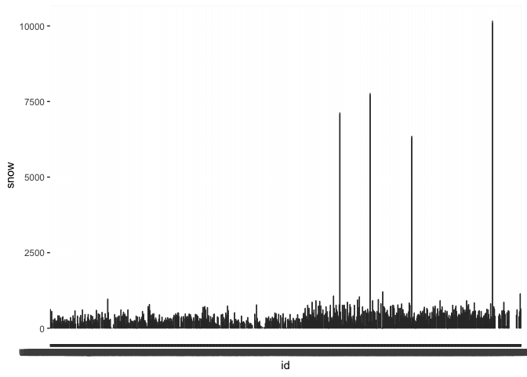

P1805_HW3_kp2809
================
Kimberly Lopez
2024-10-07

Loading Data

``` r
library(tidyverse)
```

    ## ── Attaching core tidyverse packages ──────────────────────── tidyverse 2.0.0 ──
    ## ✔ dplyr     1.1.4     ✔ readr     2.1.5
    ## ✔ forcats   1.0.0     ✔ stringr   1.5.1
    ## ✔ ggplot2   3.5.1     ✔ tibble    3.2.1
    ## ✔ lubridate 1.9.3     ✔ tidyr     1.3.1
    ## ✔ purrr     1.0.2     
    ## ── Conflicts ────────────────────────────────────────── tidyverse_conflicts() ──
    ## ✖ dplyr::filter() masks stats::filter()
    ## ✖ dplyr::lag()    masks stats::lag()
    ## ℹ Use the conflicted package (<http://conflicted.r-lib.org/>) to force all conflicts to become errors

``` r
library(p8105.datasets)
data(ny_noaa)
```

The ny_noaa data set has 7 columns and 2.5 million row entries which
detail the id, date of observed data, and precipitation, snow, snwd,
temperature max, and temperature min. There is some missing data in
columns for precipitation, snwd, tempertaure max and min.

Do some data cleaning. Create separate variables for year, month, and
day. Ensure observations for temperature, precipitation, and snowfall
are given in reasonable units. For snowfall, what are the most commonly
observed values? Why?

- date has year, month, and day. Need to pivot wider and save into 3 new
  columns

``` r
ny_noaa |> 
  mutate(year = format(date, "%Y"),
         month = format(date, "%m"),
         day = format(date, "%d"))|> 
  relocate(id, date, year, month,day)
```

    ## # A tibble: 2,595,176 × 10
    ##    id          date       year  month day    prcp  snow  snwd tmax  tmin 
    ##    <chr>       <date>     <chr> <chr> <chr> <int> <int> <int> <chr> <chr>
    ##  1 US1NYAB0001 2007-11-01 2007  11    01       NA    NA    NA <NA>  <NA> 
    ##  2 US1NYAB0001 2007-11-02 2007  11    02       NA    NA    NA <NA>  <NA> 
    ##  3 US1NYAB0001 2007-11-03 2007  11    03       NA    NA    NA <NA>  <NA> 
    ##  4 US1NYAB0001 2007-11-04 2007  11    04       NA    NA    NA <NA>  <NA> 
    ##  5 US1NYAB0001 2007-11-05 2007  11    05       NA    NA    NA <NA>  <NA> 
    ##  6 US1NYAB0001 2007-11-06 2007  11    06       NA    NA    NA <NA>  <NA> 
    ##  7 US1NYAB0001 2007-11-07 2007  11    07       NA    NA    NA <NA>  <NA> 
    ##  8 US1NYAB0001 2007-11-08 2007  11    08       NA    NA    NA <NA>  <NA> 
    ##  9 US1NYAB0001 2007-11-09 2007  11    09       NA    NA    NA <NA>  <NA> 
    ## 10 US1NYAB0001 2007-11-10 2007  11    10       NA    NA    NA <NA>  <NA> 
    ## # ℹ 2,595,166 more rows

``` r
ny_noaa |> 
  select(snow)|>
  drop_na()|>
  pull(snow)|> 
  range()
```

    ## [1]   -13 10160

``` r
ny_noaa|>
  ggplot(aes(x= id,y = snow)) + 
  geom_violin()
```

    ## Warning: Removed 381221 rows containing non-finite outside the scale range
    ## (`stat_ydensity()`).

    ## Warning: Groups with fewer than two datapoints have been dropped.
    ## ℹ Set `drop = FALSE` to consider such groups for position adjustment purposes.
    ## Groups with fewer than two datapoints have been dropped.
    ## ℹ Set `drop = FALSE` to consider such groups for position adjustment purposes.
    ## Groups with fewer than two datapoints have been dropped.
    ## ℹ Set `drop = FALSE` to consider such groups for position adjustment purposes.
    ## Groups with fewer than two datapoints have been dropped.
    ## ℹ Set `drop = FALSE` to consider such groups for position adjustment purposes.
    ## Groups with fewer than two datapoints have been dropped.
    ## ℹ Set `drop = FALSE` to consider such groups for position adjustment purposes.

<!-- -->

Make a two-panel plot showing the average max temperature in January and
in July in each station across years. Is there any observable /
interpretable structure? Any outliers?

Make a two-panel plot showing (i) tmax vs tmin for the full dataset
(note that a scatterplot may not be the best option); and (ii) make a
plot showing the distribution of snowfall values greater than 0 and less
than 100 separately by year.
